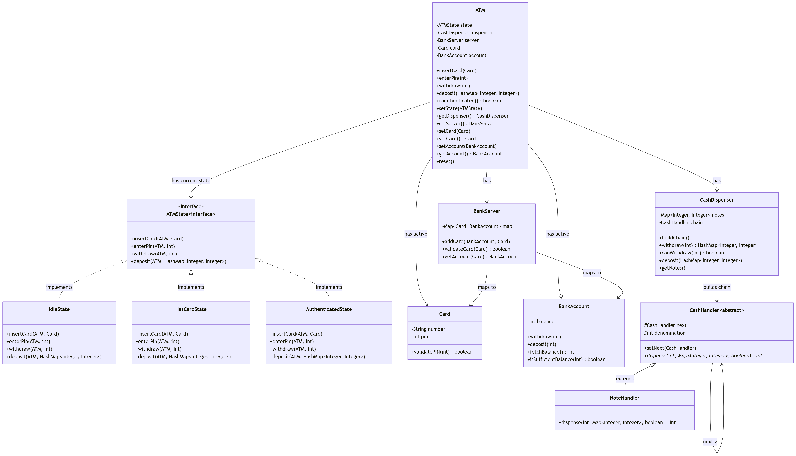

# Functional Requirements
- Insert a card and validate it against a centralized bank server.
- Enter a PIN to authenticate the user for the session.
- Withdraw cash in available denominations (2000, 500, 100) using the least number of notes possible.
- Deposit cash into the bank account and restock the ATM's cash inventory.
- Validate sufficient balance in the bank account before withdrawing.
- Validate sufficient cash availability in the ATM before dispensing.
- End session and reset to idle state after each successful or failed transaction.

# Non-Functional Requirements
- Modularity of code
- Extensible to new features (e.g. new card types, new denominations)
- Easily maintainable

# Core Entities
- Card (number, pin) — represents a debit/credit card with a PIN for authentication.
- BankAccount (balance) — holds the user's balance; supports withdraw(), deposit(), fetchBalance().
- BankServer (card-account mapping) — validates cards and retrieves associated accounts.
- CashDispenser (notes map, handler chain) — manages cash inventory and dispenses notes using the chain of responsibility.
- State (IdleState, HasCardState, AuthenticatedState) — governs ATM behavior based on the current stage of a session.
- CashHandler (NoteHandler)
- ATM (state, dispenser, server, card, account) — central context that delegates operations to the current state.

# Design Patterns
- State Pattern — (ATMState interface implemented by IdleState, HasCardState, AuthenticatedState) to encapsulate behavior changes when the ATM transitions between idle, card-inserted, and authenticated states.
- Chain of Responsibility Pattern — (CashHandler → NoteHandler) to dispense cash by trying higher denominations first and passing the remainder down the chain.

# UML Diagram
