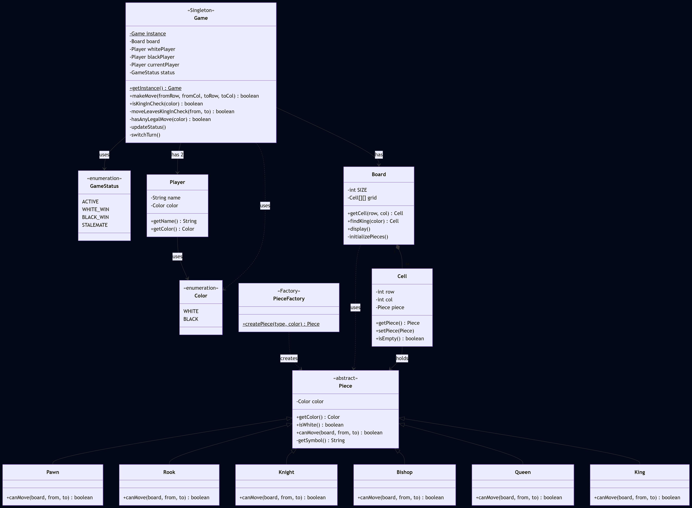

# Functional Requirements
- 8x8 grid
- One player will be "WHITE" and other will be "BLACK"
- Declare winner/draw on game completion
- Reject invalid moves
  
# Non-Functional Requirements
- Should follow OOPs concepts
- Code should be modular and extensible
- Game logic should be easy to maintain

# Core Entities
- Board (made up of cells)
- Cell (coordinates)
- Piece (isWhite and coordinates)
- Move (source and destination coordinates)
- Player (name and isWhite)
- GameStatus (ACTIVE, WHITE_WIN, BLACK_WIN, STALEMATE)
- Game

# Design Patterns
- Strategy Design Pattern - Piece Movement
- Factory Design Pattern - Piece Creation
- Singleton Design Pattern - Single Game instance

# UML Diagram

