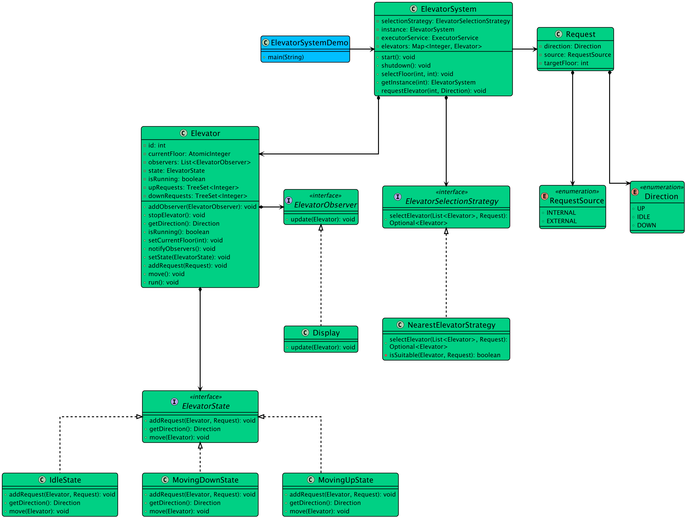

# Functional Requirements
- Multiple elevators serving multiple floors
- Each elevator with max capacity
- User should be able to request an elevator from any floor and select any target floor
- Optimise the movement of elevators and minimise waiting time for users
- Prioritize requests based on direction of movement and proximity of elevators
- Handle multiple requests, ensure thread safety and prevent race conditions
  
# Non-Functional Requirements
- Should follow OOPs concepts
- Code should be modular and extensible

# Core Entities
- Direction (enum - UP, DOWN, IDLE)
- RequestSource (enum - INTERNAL, EXTERNAL)
- Request (int floor, direction)
- ElevatorState (Up, Down, Idle)
- Elevator (currentFloor, direction, List[Request])
- ElevatorSystem(Singleton)

# Design Patterns
- Singleton - (ElevatorSystem)
- Strategy - (Handle requests efficiently)

# UML Diagram

