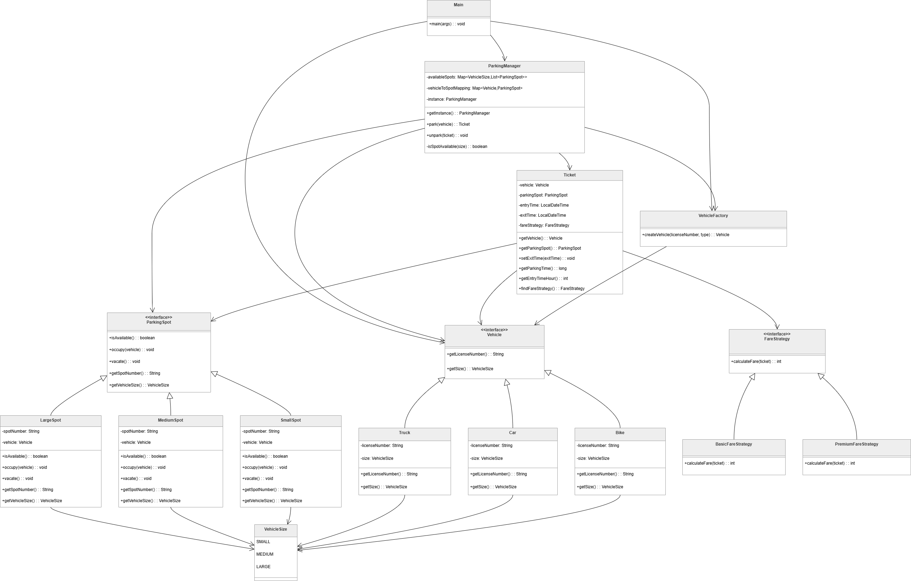

# Functional Requirements
- Vehicles can be parked and unparked
- Generate a ticket
- Calculate Fare with stategy
- Allocate spot according to vehicle size

# Non-Functional Requirements
- Modularity of code
- Extensible to new features
- Easily maintainable

# Core Entities
- VehicleSize - enum (SMALL, MEDIUM, LARGE)
- Vehicle (Car, Bike, Truck) - License Number, VehicleSize
- VehicleFactory
- Parking Manager - parkVehicle, unparkVehicle, generate ticket
- Ticket - Vehicle, ParkingSpot, ArrivalTime, DepartureTime, FareStrategy
- Fare Strategy - (Basic and Premium Fare)

# Design Patterns
- Strategy Pattern - to calculate the fare
- Singleton Patter - parking lot instance
- Factory Pattern - instantiate vehicles

# UML Diagram
