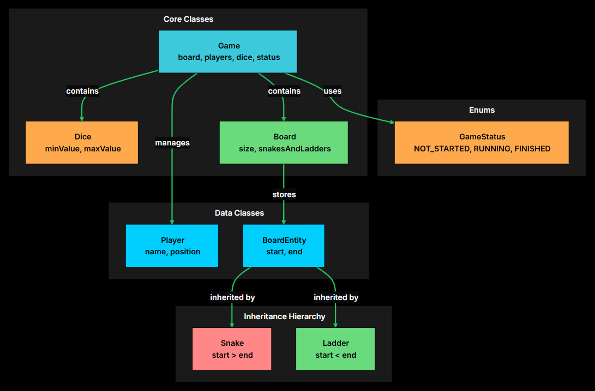
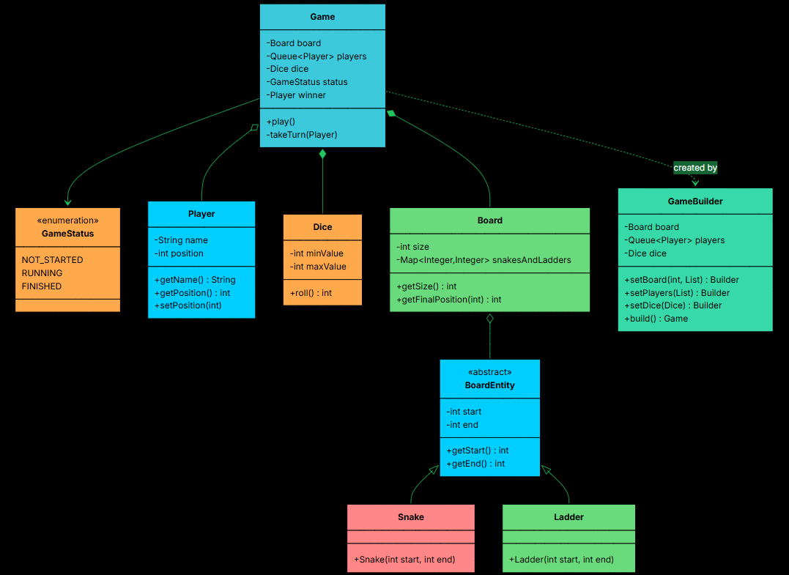

# Functional Requirements
- 10x10 board
- Snakes move players backward
- Ladders move players forward
- Multiple players
- Dice roll (1-6 random values)
- Multiple players can land to same cell
- Whoever reaches 100 first wins the game  

# Non-Functional Requirements
- Modularity of code
- Extensible to new features
- Easily maintainable

# Core Entities
- Board
- BoardEntity (abstract class)
- Snake (extends BoardEntity, start position should be higher than end position)
- Ladder (extends BoardEntity, end position should be higher than start position)
- Player (name, position)
- Dice
- GameStatus - (NOT_STARTED, RUNNING, FINISHED)
- Game

# ER Diagram

# Design Patterns
- Builder Pattern - Setting up board, players, snakes, ladders, dice
- Template Method - BoardEntity defines common structure for snakes and ladders
- Facade Pattern - Game acts as single point of entry and rest of the logic is hidden

# UML Diagram
