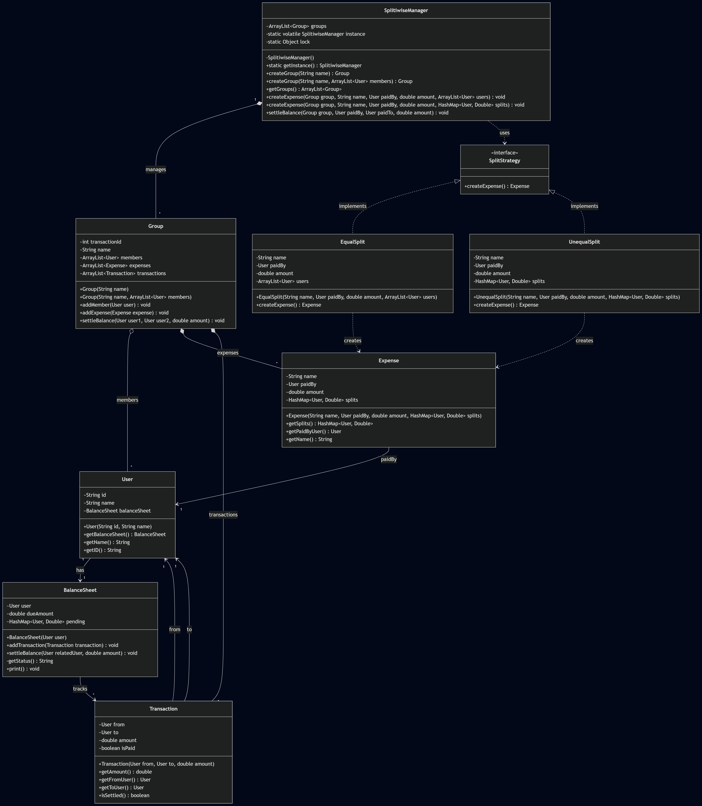

# Functional Requirements
- Create groups with multiple members
- Add expenses with equal or unequal splits
- Track outstanding balances between users
- Settle payments and update balance sheets
- Validate that expense splits match the total amount
- Generate balance sheet reports for individual users

# Non-Functional Requirements
- Modularity of code
- Extensible to new features
- Easily maintainable
- Support concurrent transactions with thread-safe operations

# Core Entities
- User (is, name, BalanceSheet)
- Expense (name, paidBy, amount, splits)
- Transaction (from, to, amount, isPaid)
- Group (name, members, expenses, transactions)
- BalanceSheet (user, pending, dueAmount)
- Split Strategy (Equal and unequal)
- Splitwise Manager(groups, instance)

# Design Patterns
- Singleton Pattern - (Splitwise to ensure thread safety and handle concurrent requests)
- Strategy Pattern - (Expense equal and unequal split strategy)

# UML Diagram
