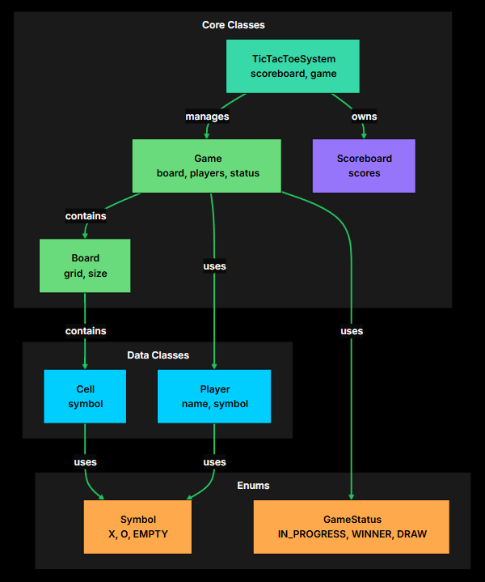
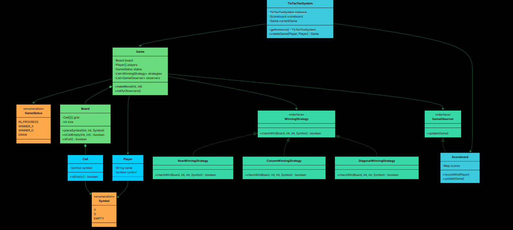

# Functional Requirements
- 3x3 grid
- One player uses "X" and other uses "O"
- Declare winner/draw on game completion
- Reject invalid moves
- Maintain scoreboard for multiple games
  
# Non-Functional Requirements
- Should follow OOPs concepts
- Code should be modular and extensible
- Game logic should be easy to maintain

# Core Entities
- Board (made up of cells)
- Cell 
- Player (name and symbol)
- Symbol (X, O, EMPTY)
- Game (validateMove, makeMove, checkWin, switchTurn)
- Game Status
- Scoreboard (track individual player scores across multiple games)
- TicTacToeSystem (central controller)

# ER Diagram

# Design Patterns
- Strategy Design Pattern - WinnerStrategy (win detection)
- Observer Design Pattern - GameObserver (scoreboard updates)
- Singleton Design Pattern - TicTacToeSystem (getInstance)

# UML Diagram

