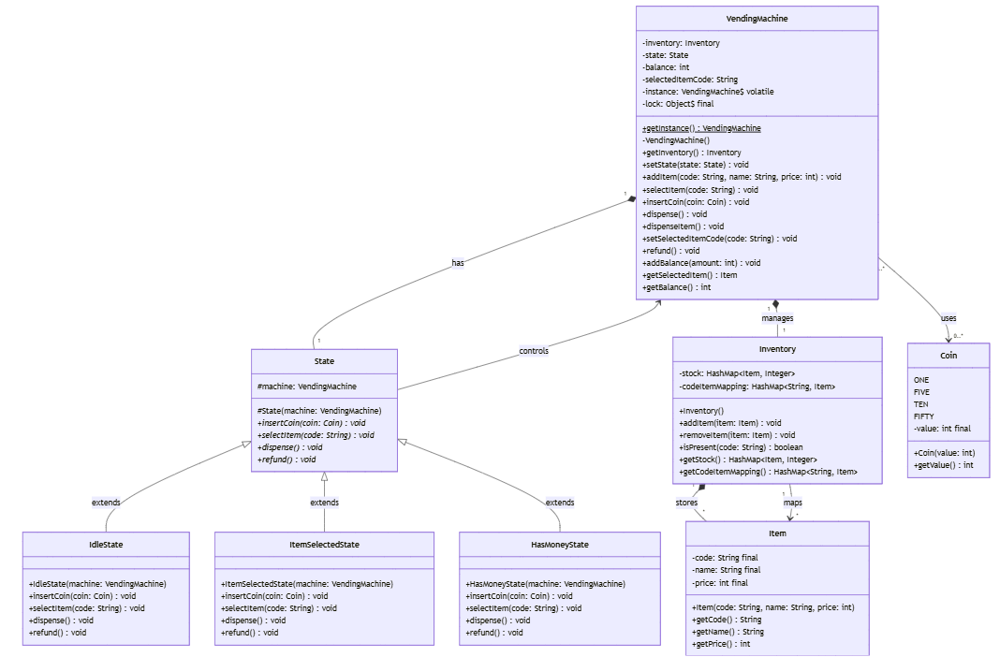

# Functional Requirements
- Support multiple products with different prices and quantities.
- Accept coins of different denominations.
- Dispense the selected product and return change if necessary.
- Keep track of the available products and their quantities.
- Handle multiple transactions concurrently and ensure data consistency.
- Provide an interface for restocking products and collecting money.

# Non-Functional Requirements
- Modularity of code
- Extensible to new features
- Easily maintainable

# Core Entities
- Coin (enum)
- Item (code, name, price)
- Inventory (stock, codeItemMapping, addItem(), removeItem())
- State (idle, itemSelected, hasMoney)
- VendingMachine (inventory, state)

# Design Patterns
- Singleton Pattern - (VendingMachine to ensure thread safety and handle concurrent requests)

# UML Diagram
