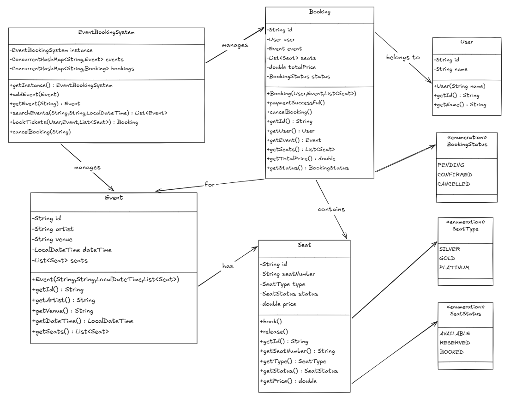

# Functional Requirements
- The concert ticket booking system should allow users to view available concerts and their seating arrangements.
- Users should be able to search for concerts based on various criteria such as artist, venue, date, and time.
- Users should be able to select seats and purchase tickets for a specific concert.
- The system should handle concurrent booking requests to avoid double-booking of seats.
- The system should ensure fair booking opportunities for all users.

# Non-Functional Requirements
- Modularity of code
- Extensible to new features
- Easily maintainable
- Support concurrent transactions with thread-safe operations

# Core Entities
- User
- Seat
- Event
- Booking
- enums - BookingStatus, SeatStatus, SeatType
- EventBookingSystem

# Design Patterns
- Singleton Pattern

# UML Diagram
